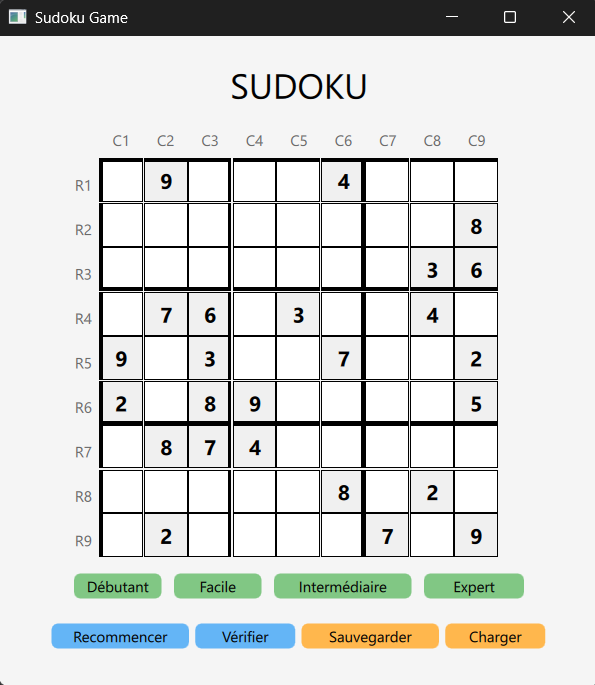
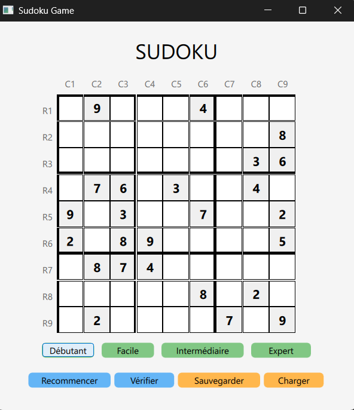
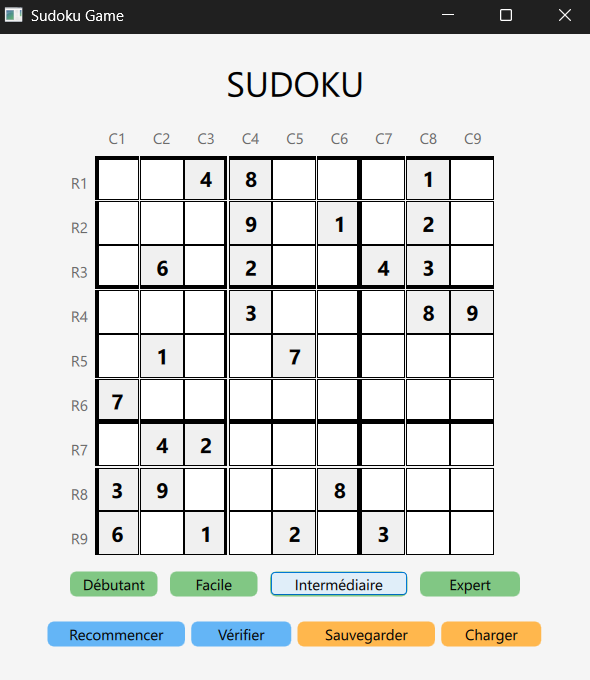
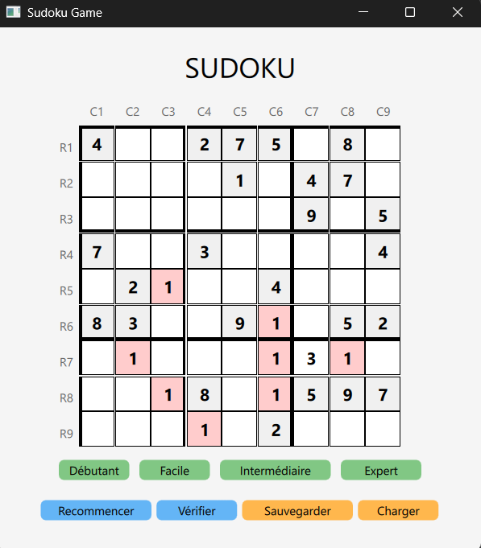
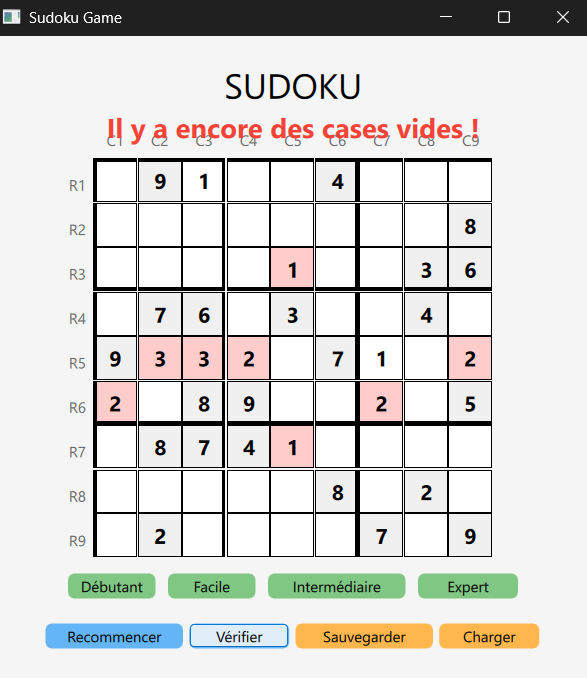

# 🧩 Sudoku - Jeu interactif développé en C++ / QML

## 👩‍💻 Concepteurs

Ce projet a été développé par :

- Amani KRID  
- Youssef MILED

---

## 🎯 Objectif du projet

Ce projet consiste à implémenter un jeu de Sudoku interactif avec une interface graphique basée sur **QML** et une logique métier en **C++**, permettant à l’utilisateur :

- de générer une grille selon différents niveaux de difficulté (débutant, facile, intermédiaire, expert) [**BONUS**],
- de remplir les cellules tout en respectant les règles du Sudoku,
- de détecter automatiquement les conflits dans les lignes, colonnes et blocs 3x3 [**BONUS**],
- de sauvegarder/recharger une partie en cours [**BONUS**],
- de vérifier si la solution est correcte.

---

## 📸 Aperçu de l’interface

> _(Voici quelques captures illustrant les différentes configurations du jeu)_

### 🟢 Menu principal


### 🔰 Grille - Niveau débutant


### 🟡 Grille - Niveau intermédiaire


### ❌ Exemple de conflit détecté (ligne ou colonne)


### ⚠️ Exemple de message conflit dans un bloc 3x3


---

## ⚙️ Utilisation

### 🔧 Prérequis

- Qt 6 (avec Qt Quick)
- Qt Creator (recommandé pour une ouverture rapide du projet)
- Un système compatible : **Linux**, **Windows** ou **macOS**

---


### 🕹️ Logique du jeu

- Le joueur choisit une difficulté (grille pré-remplie partiellement selon le niveau).

- Il peut cliquer sur les cellules vides pour modifier leur valeur : chaque clic fait incrémenter la valeur entre 1 → 9 → vide.

- Le bouton "Vérifier" analyse automatiquement la grille :

        - détection des doublons dans lignes, colonnes et blocs 3×3,

        - affichage de messages d'erreur en cas de conflit.

- Le joueur peut sauvegarder sa progression, et la recharger plus tard.

- Un bouton "Recommencer" permet de relancer une nouvelle grille du même niveau.

### 🚧 État d'avancement

Le projet est **terminé** et pleinement fonctionnel ✅ 

### ▶️ Lancer le projet

Cloner le dépôt :
   ```bash
   git clone https://gitlab.ec-lyon.fr/akrid/sudoku/
   
   Sélectionne "Ouvrir un projet" dans Qt Creator et choisissez le fichier CMakeLists.txt.

   Assurez-vous qu’un exécutable est bien configuré dans le projet.

   Compilez le projet en appuyant sur Ctrl + B ou en cliquant sur "Construire" (ou "Build").

   Puis lancez le programme en cliquant sur le bouton "Exécuter" (ou "Run").


